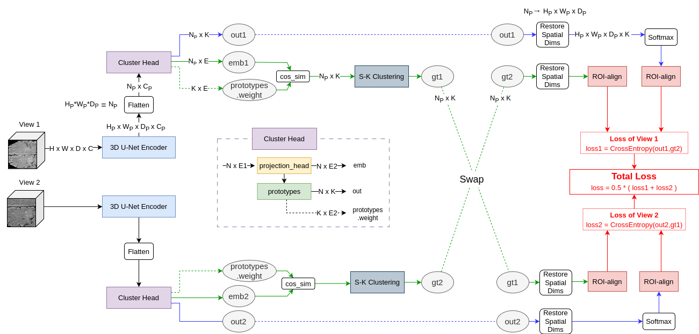
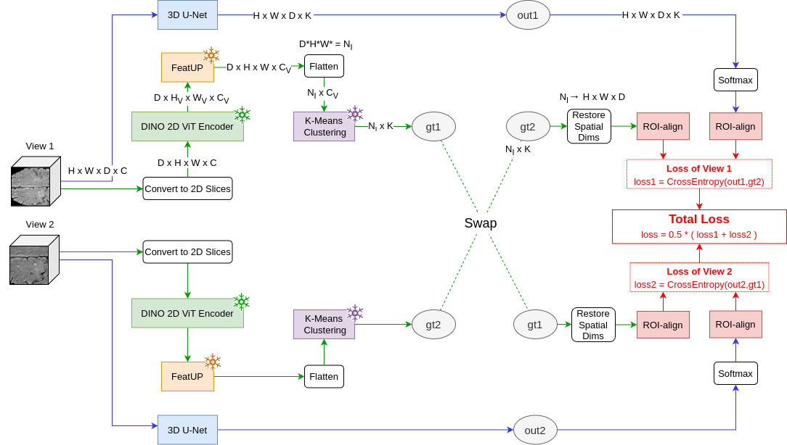
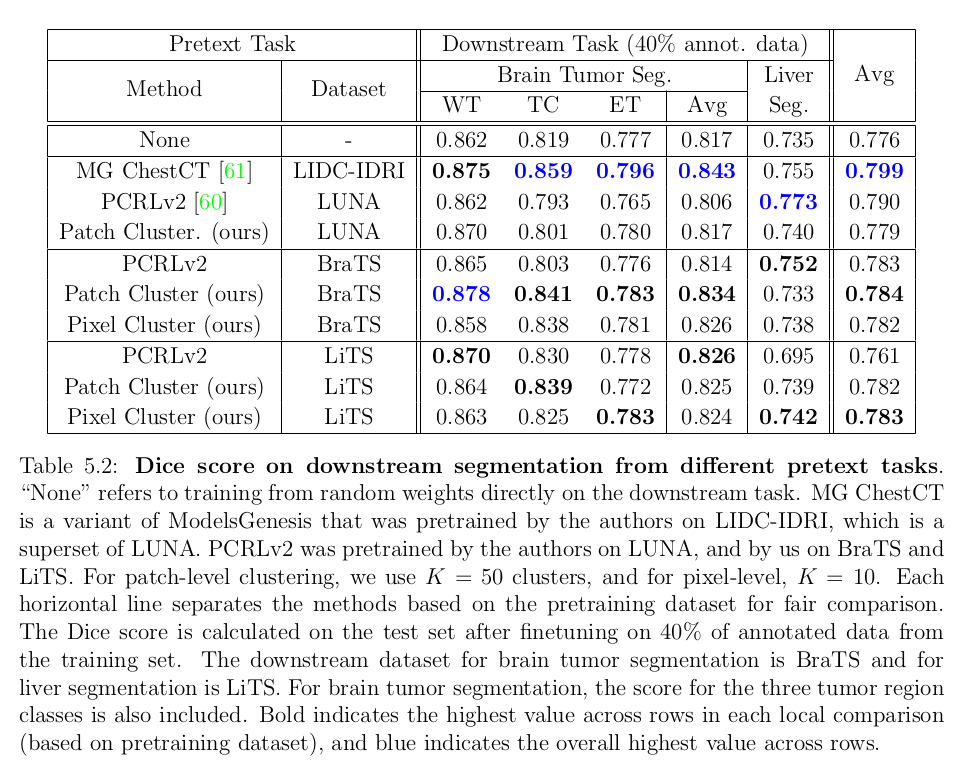

# Self-Supervised Learning for Radiology
_Note: If you find any issues with the repository let me know by submitting an issue or sending a message_


## Thesis Description
Document: [link](https://dspace.uba.uva.nl/server/api/core/bitstreams/c6347794-efdf-44b4-ba18-fc39c25edc45/content) \
\
"Self-supervised Learning for Radiology", Ioanna Gogou, University of Amsterdam, 2024 \
\
_Deep neural networks have the potential to revolutionize diagnosis in radiology by enabling faster and more precise interpretation of medical images. Despite the success of supervised learning to train these models, its dependency on large annotated datasets presents a major limitation due to the difficulty in acquiring and labeling medical images. This has led to a growing interest in self-supervised learning, which alleviates this issue by generating an artificial supervisory signal from the data itself. This thesis explores the potential of self-supervised learning for segmenting 3D radiology scans. Inspired by previous spatially dense self-supervised methods that showed great success with 2D natural images, we propose patch-level and pixel-level volumetric clustering as a novel pretext task for representation learning on 3D medical data without labels. We evaluated this approach on brain tumor and liver segmentation under limited annotation conditions. Our findings indicate that, while it did not surpass other state-of-the-art self-supervised methods on average, it demonstrated promising results in certain tasks. Moreover, it enhanced segmentation accuracy compared to purely supervised learning and yielded anatomically meaningful representations. However, challenges such as noisy cluster assignments and foreground-background imbalance were observed, suggesting the need for further refinement._

## Datasets
### [BraTS-18](https://www.kaggle.com/datasets/harshitsinghai/miccai-brats2018-original-dataset) | [LiTS-17](https://competitions.codalab.org/competitions/17094#participate-get-data) | [LUNA-16](https://luna16.grand-challenge.org/Download/)

```
data/
├── BraTS18/
│   ├── HGG/
│   │   └── Brats18_X_X_X/
│   │       ├── Brats18_X_X_X_flair.nii.gz 
│   │       ├── Brats18_X_X_X_t1.nii.gz 
│   │       ├── Brats18_X_X_X_t1ce.nii.gz 
│   │       └── Brats18_X_X_X_seg.nii.gz 
│   └── LGG/
│       └── ...
├── LiTS17/
|   ├── train/
|   │   ├── ct/
|   │   │   ├── volume-0.nii
|   │   │   ├── ...
|   │   │   ├── volume-27.nii
|   │   │   ├── volume-48.nii
|   │   │   ├── ...
|   │   │   └── volume-130.nii
|   │   └── seg/
|   │       ├── segmentation-0.nii
|   │       ├── ...
|   │       ├── segmentation-27.nii
|   │       ├── segmentation-48.nii
|   │       ├── ...
|   │       └── segmentation-130.nii
|   └── val/
|       ├── ct/
|       │   ├── volume-28.nii
|       │   ├── ...
|       │   └── volume-47.nii
|       └── seg/
|           ├── segmentation-28.nii
|           ├── ...
|           └── segmentation-47.nii
└── LUNA16/
    ├── subset0/
    │   ├── X.X.X.X.X.X.X.X.X.X.X.X.X.raw
    │   └── X.X.X.X.X.X.X.X.X.X.X.X.X.mhd
    ├── ...
    └── subset9/
        └── ...

```

## Learning Tasks
* Pretext Tasks: \
  _(Performed using datasets BraTS, LiTS, LUNA)_
    * None (downstream task training from scratch)
    * Patch-level Clustering (ours)
    * Pixel-level Clustering (ours)
    * [PCRLv2](https://arxiv.org/abs/2301.00772)
    * [ModelsGenesis](https://arxiv.org/abs/1908.06912)
 * Downstream Tasks:
    * Brain Tumor Segmentation (BraTS)
    * Liver Segmentation (LiTS)

## Method
### Patch-level Clustering
 
### Pixel-level Clustering
 

## Results
 

## Requirements
1. Clone repository to preferred path e.g. ``/path/to/radioSSL``
2. Go to repository directory: ``cd /path/to/radioSSL``
3. Install conda environment: ``conda env create -f environment.yml``

## Pipeline Execution
### Pretext Task (Pretraining)
   1. Dataset Preprocessing:
       * Example: \
         _(dataset: BraTS, crop size: 128x128x32, crops have max background pixels: 85%)_ \
         ``python preprocess_cluster_images.py --n brats --input_rows 128 --input_cols 128 --input_deps 32 --data /projects/0/prjs0905/data/BraTS18 --save /path/to/data/BraTS18_proc_128 --bg_max 0.85``
   2. K-Means Training (**Only for pixel-level clustering**)
       * Example: \
         _(dataset: preprocessed BraTS, selected gpu device: {0,1}, batch size: 2, clusters: 10, upsampler: FeatUP)_ \
         ``python preprocess_cluster_kmeans_train.py --n brats --data /path/to/data/BraTS18_proc_128 --gpus 0,1 --b 2 --k 10 --upsampler featup``
   3. K-Means Prediction / Ground Truth Generation (**Only for pixel-level clustering**)
       * Example: \
         _(dataset: preprocessed BraTS, selected gpu devices: {0,1}, batch size: 2, clusters: 10, upsampler: FeatUP)_ \
         ``python preprocess_cluster_kmeans_predict.py --n brats --data /projects/0/prjs0905/data/BraTS18_proc_128 --gpus 0,1 --b 2 --k 10 --upsampler featup --centroids /path/to/data/BraTS18_proc_128/kmeans_centroids_k10_featup.npy``
   4. Pretext Task Training
      * Example Patch-level Clustering: \
         _(dataset: preprocessed BraTS, dimensions: 3D, gpu devices: {0,1}, batch size: 16, epochs: 240, learnining rate: 2e-3, clusters: 50, clustering loss: SwapCE, visualize clusters: True)_ \
        ``python main.py --data /path/to/data/BraTS18_proc_64 --model cluster_patch --n brats --d 3 --phase pretask --gpus 0,1 --b 16 --epochs 240 --lr 2e-3 --k 10 --cluster_loss swav --output /path/to/runs/pretrain --tensorboard --vis``
      * Example Pixel-level Clustering: \
        _(dataset: preprocessed BraTS, dimensions: 3D, gpu devices: {0,1}, batch size: 8, epochs: 150, learnining rate: 4e-3, clusters: 10, clustering loss: SwapCE, upsampler: FeatUp, visualize clusters: True)_ \
        ``python main.py --data /path/to/data/BraTS18_proc_128 --model cluster --n brats --d 3 --phase pretask --gpus 0,1 --b 8 --epochs 240 --lr 4e-3 --k 10 --cluster_loss swav --upsampler featup --output /path/to/runs/pretrain --tensorboard --vis``  
      * Example PCRLv2: \
        _(dataset: preprocessed BraTS, dimensions: 3D, gpu devices: {0,1}, batch size: 16, epochs: 240, learnining rate: 2e-3)_ \
        ``python main.py --data /path/to/data/BraTS2018_proc_64 --model pcrlv2 --n brats --d 3 --gpus 0,1 --b 16 --epochs 240 --lr 2e-3 --output /path/to/runs/pretrain --tensorboard``
### Downstream Task (Finetuning)
   1. Downstream Task Training
      * Example: \
        _(dataset: BraTS, pretrained model: pixel-level clustering, dimensions: 3D, gpu devices: {0,1}, use skip connections: True, batch size: 4, epochs: 300, learnining rate: 2e-3, pretrained part: encoder, finetuning trainable part: encoder and decoder, data ratio for finetuning: 0.4)_ \
        ``python main.py --data /path/to/data/BraTS18 --model cluster --n brats --d 3 --gpus 0,1 --skip_conn --phase finetune --pretrained encoder --finetune all --ratio 0.4 --lr 1e-3 --b 4 --epochs 300 --output /path/to/runs/finetune --tensorboard --vis --weight /path/to/runs/pretrain/cluster_brats_pretrain/cluster_3d_k10_swav_pretask_b4_e150_lr004000_t171784351201312.pt``
   3. Downstream Task Testing
      * Example: \
        _(dataset: BraTS, pretrained model: pixel-level clustering, dimensions: 3D, gpu devices: {0,1}, use skip connections: True, batch size: 4)_ \
        ``python main.py --data /path/to/data/BraTS18 --model cluster --n brats --d 3 --gpus 0,1 --phase test --skip_conn --b 4 --weight /path/to/runs/finetune/brats_finetune_cluster_brats_pretrain/cluster_3d_k10_sc_pretrain_encoder_finetune_all_b4_e300_lr001000_r40_t17179782752213416.pt --tensorboard
``

## Model Weights
### Pretrained Weights
| Pretext Task / Dataset                 | BraTS | LiTS | LUNA |
|-----------------------|-------|------|------|
| Patch-level Clustering |   [+](https://drive.google.com/file/d/1LliLdUt2zCDpT6Cx6fgEJzT8WP-ftI0d/view?usp=drive_link)   |   [+](https://drive.google.com/file/d/1bcfnIMCf_BvyC86Bj5yHnLX2eu0hFaIx/view?usp=drive_link)  |  [+](https://drive.google.com/file/d/19pkTEy9oreZcNqeZsF_qriH43IKsZFle/view?usp=drive_link)  |
| Pixel-level Clustering |   [+](https://drive.google.com/file/d/1sr0oKAEatDXJNG8FnZEyJBAKq_O7GN0x/view?usp=drive_link)   |  [+](https://drive.google.com/file/d/1veTXyDs1yKb2u-w933hRCGYBoNXmzXe6/view?usp=drive_link)   |  -  |

### Finetuned Weights
_Note: The pretrained model was finetuned by transfering only the **encoder** from the corresponding pretext task to the downstream task and training on **40%** of the downstream dataset)_
| Downstream Task / Pretext Task                | BraTS Patch-level Clustering | BraTS Pixel-level Clustering |
|-----------------------|-------|------|
| Brain Tumor Segmentation |  [+](https://drive.google.com/file/d/1YM1UA1qQZ4ieOq3rRvsrrNAGE7BuhiG5/view?usp=drive_link)  |  [+](https://drive.google.com/file/d/11QQwCnug6dyCe0Z6zjisfx1USWIOtnre/view?usp=drive_link)   |
| Liver Segmentation |  [+](https://drive.google.com/file/d/1VBZy2yvJiMqlItOjXA69T4hjhgLjuWL3/view?usp=drive_link)  |  [+](https://drive.google.com/file/d/1wl0mLAmQunRoDRPRzl90OoW_uYNOlCJp/view?usp=drive_link)   |

## Aknowledgmenets
We thank the authors of the following repositories, parts of which were used for this project: [RL4M/PCRLv2](https://github.com/RL4M/PCRLv2), [MrGiovanni/ModelsGenesis](https://github.com/MrGiovanni/ModelsGenesis)
